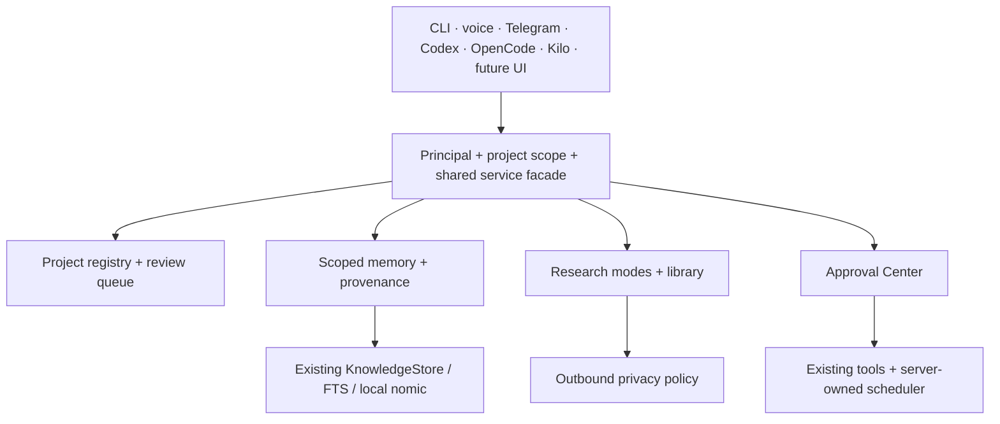

# Phase 1 — Personal Knowledge & Project Intelligence

Design date: 2026-10-09. This is a proposed, incremental architecture. The
publication prerequisite is Phase 0.5 draft PR #2, with successful CI on its
exact head. No project-state migration or project manifest write is authorized
by preparing this document. Apply operations require their own reviewed plan.

## Current-state audit

| Surface | Current implementation | Gap and consequence |
| --- | --- | --- |
| Projects | `projects/discovery.py`, JSON registry schema 2 | 600 scanner proposals: 144 active, 455 reference, 1 archive; no user confirmation |
| Identity | Project ids are slugs of relative paths | Zero current duplicate ids/paths, but rename/path changes change identity and slug collisions are possible |
| Facts | Name/path/type/languages/frameworks/markers/Git remote+branch/role/collection | No priority, dirty state, activity, commands, runtime requirements, site associations, index freshness or task counts |
| Consumers | `projects list`, `project_registry` tool, daily metadata scan | Scanner overwrite must never replace future human decisions |
| Documents | Configured SQLite `memory.db` with documents and FTS | Preserve existing retrieval and CLI; project namespace and scoped provenance are absent |
| Knowledge | Existing `KnowledgeStore`, `knowledge.db`, FTS, BLOB embeddings, content hash, `HybridSearch` | Reuse this implementation; scope/project/path/line/commit/freshness must be first-class and enforced before retrieval |
| Embeddings | `OllamaEmbedder`, installed nomic, 768 float32 dimensions | Functional local evidence exists; identity includes model digest/dimension/chunking version, not just a mutable tag |
| Durable facts | `MemoryService`/`FactStore`, local JSONL or configured backend | Existing compact fact extraction is useful; do not reinterpret all chat transcripts as durable knowledge |
| Sessions | Native channel bridge SQLite sessions and managed-agent sessions | Isolation is transport/conversation state, not a separate long-term brain; a principal/project mapping is still needed |
| Approvals | `ApprovalStore` in `approvals.db`, `pending_actions`, permission memory, HTTP approve/deny | Extend the store and routes; existing remembered permission patterns are not authorization for arbitrary new plans |
| Tasks | Owned `TaskScheduler`, existing scheduler SQLite; managed-agent task tables | Keep scheduling separate from user work items; link ids rather than create another scheduler |
| Research | Local protected planners, source-aware tools; public editor pool | Explicit modes, sanitized outbound-query preview and durable artifact library are absent |
| Models | Local aliases, installed capability metadata, dynamic free roster | Catalog capability is not measured quality; no benchmark-based promotion exists yet |
| Machine | Metadata inventory, WAMP/runtime/cache discovery, read-only hygiene reports | A capability catalog and per-project toolchain checks are needed; presence does not mean acceptance |

Observed local databases also include agents, audit, digest, telemetry and
traces. Audit them using SQLite `mode=ro`; opening their service constructors
can create/migrate tables. Never move or consolidate these files as an implicit
Phase 1 operation. Existing stores remain behind shared service interfaces.
The finalizer's existing metadata-only scan may refresh the scanner JSON;
that is not a canonical Project Intelligence migration.

## One shared service boundary



The authenticated local principal is the same user across authorized clients.
An allowed Telegram chat binds to that principal; its conversation history
remains isolated. A project id determines retrieval scope. Clients pass that
scope explicitly; a project name does not silently choose another project's
context. Missing/ambiguous names require selection. No client owns a second
durable memory or approval database.

Preserve `/router/v1` as a direct OpenAI-compatible endpoint. It must not
silently inject private project context into an editor's public/free request.
Future project/context/search tools expose the shared services through local
API/MCP adapters, so editors can request scoped context explicitly. CLI,
personal `/v1`, channel and voice adapters call the same facade. Implementation
will add these adapters incrementally, without a server or namespace rewrite.

## Proposed data contracts

All contracts have `schema_version`, a migration version, UTC timestamps and
source provenance. Unknown future versions fail closed; unknown fields are
reported rather than silently discarded. JSON schemas/examples document the
contracts; storage migrations are separate reviewed artifacts.

### Canonical Project v1

| Field | Type/default | Authority |
| --- | --- | --- |
| project_id | Immutable UUID | Persisted once at approved adoption, never recomputed on rename |
| name, canonical_path, aliases | String, absolute path, string list | Explicit manifest/review, then scanner defaults |
| role | active/client/personal/reference/archive/template/generated/experimental/unknown | User-confirmed role; scanner role is a separate proposal |
| status, priority | proposed/confirmed/paused/archived; nullable integer 0–5 | Human review; new records proposed, priority unknown |
| last_activity | Nullable UTC timestamp + source | Git/filesystem evidence; unknown stays unknown |
| git | repo flag, remotes, branch, dirty nullable, commit, observed_at | Read-only observation; redact URL credentials; never infer ownership from remote |
| languages, frameworks, package_managers | String lists | Manifest override or bounded metadata evidence |
| runtime_requirements | Map of runtime to version constraint | Metadata/manifest, with source |
| project_type | String | Manifest/scanner |
| local_url, production_url, staging_url | Nullable URL | Human/manifest; no credentials in URLs |
| wamp_mapping | Nullable vhost/document root/runtime association | Local config evidence; never read WordPress secrets |
| related_sites, related_repositories | Id lists with relation type | Reviewed links, no implicit merges |
| commands | dev/test/lint/build arrays of argv or declared shell command | Captured as data; inspection never executes them |
| documentation_roots | Relative paths | Confined to approved project root |
| knowledge | include/exclude patterns, privacy, max bytes, allowed extensions | Security exclusions win over manifest includes |
| health_state | unknown/ready/degraded/blocked + reasons | Timestamped observed checks; installed does not mean validated |
| open_task_count | Integer derived from task records | Derived, not a second task store |
| last_audit, last_knowledge_index | Nullable UTC timestamp + evidence id | Actual completed runs |
| tags | String list | User/manifest |
| provenance | Per-field source, observed_at, content hash, confirmation | Record inference separately from confirmed values |
| revision | Monotonic integer | Optimistic concurrency; stale reviews cannot overwrite updates |

Store proposed canonical project/review/link tables in the existing configured
KnowledgeStore database when migration is approved. Add `project_id_map` linking
legacy ids/path keys to immutable UUIDs. Keep scanner JSON schema 2 as an input
snapshot and provide the old shape to existing consumers during transition.
Do not overwrite scanner ids or automatically merge similarly named roots.

Review items contain `review_id`, `snapshot_sha256`, `scanner_project_id`, path,
proposed role/facts, evidence, missing fields, conflicts, candidate canonical id
and pending/confirmed/reclassified/deferred state. Batch decisions are exact
id-to-role mappings with the snapshot hash and expected revisions. Never apply
an entire classification based only on an active count or name heuristic.

### Project manifest v1

Optional location: `.openjarvis/project.toml`. Example proposed contents:

```toml
schema_version = 1
migration_version = 0
name = "Example plugin"
role = "personal"
project_type = "wordpress-plugin"
aliases = ["example-plugin"]
tags = ["wordpress"]

[commands]
test = ["composer", "test"]
lint = ["composer", "lint"]

[knowledge]
privacy = "private-project"
include = ["README.md", "docs/**", "src/**"]
exclude = [".env*", "wp-config.php", "node_modules/**", "vendor/**"]
```

An approved canonical UUID may be added as `project_id`; a preview never
allocates durable identity. Only explicitly present manifest fields override
inference, including empty lists. Commands are validated but not executed.
Relative roots cannot escape the project, traverse junctions or read credentials.
Precedence is security policy → confirmed manifest values → reviewed facts →
scanner proposal. Conflicting manifest/review revisions appear in the queue;
they do not silently replace human decisions. Initial manifest adoption and
version upgrades always show the complete TOML/diff first. No project write
occurs during validation or preview.

### Memory Fabric v1

| Scope | Canonical representation | Recall rule |
| --- | --- | --- |
| GLOBAL | Existing USER.md/SOUL.md/MEMORY.md and compact trusted facts | Small human-editable identity; private by default |
| PROJECT | Scoped architecture/repo/commands/current-state summaries and source chunks | Exact selected project, provenance required |
| SESSION/EPISODIC | goal/actions/result/failures/decisions/next_steps summary | Session/project scoped; explicit promotion to durable memory |
| RESEARCH | Structured research artifact plus derived searchable text | Classification/project filters apply |
| TASK | Relational task record | Query by state/project/due date; embeddings never authoritative |
| DECISION | Relational decision record | Query by project/status/date, with supersedes links |

Extend existing `knowledge_chunks` additively with namespace/scope/project_id,
privacy/source_path/line_start/line_end/source_commit/source_hash/ingested_at/
freshness/chunking_version. Existing columns already supply content hash,
embedding bytes, model version and source identifiers. Namespace filters must
apply to lexical candidates, vectors, thread context and citations before
ranking; filtering only the final result cannot protect private context.

Embedding provenance includes installed Ollama digest, 768 dimensions and
float32 encoding. Reject incompatible dimensions/models; do not compare mixed
spaces. Lexical retrieval remains usable without embeddings. Regenerate only
derived vectors/FTS from approved source records; keep tasks, decisions and
source provenance intact. Mark stale/missing/changed files, never manufacture
freshness. No bulk reindex is implied by installing nomic.

Default exclusions: `.env` variants, credentials/secrets, `wp-config.php`, keys,
node_modules/vendor, virtual environments, caches, dist/build/target, uploads,
model stores, binaries and large generated output. Check paths case-insensitively
on Windows, resolved targets/junctions, size and extension; then scan content
for secrets before local storage. Includes cannot weaken these rules. Source
material is untrusted prompt data, never approval or executable instruction.

Tasks: `task_id/project_id/title/status/priority/due_at/timezone/owner/source/
created_at/updated_at/scheduler_task_id/approval_id`. Decisions:
`decision_id/project_id/question/decision/rationale/evidence/status/supersedes/
decided_by/decided_at`. User work items link to existing scheduler/agent ids;
they do not instantiate new background schedulers.

### Research Fabric v1

| Mode | Context and route | Outbound policy |
| --- | --- | --- |
| public | Public question, `free/research` | Public sources only; no automatic private retrieval |
| project-public | Public project sources explicitly designated by user | Public namespace allow-list; private identity/session excluded |
| private-project | Private project context, `local/research` | Local synthesis; sanitized/general public queries require preview |
| scheduled-watch | Previously approved public watch definition | Schedule/destination/queries fixed by approved plan; no implicit external recurrence |

For private research, local reasoning proposes a generalized query. A local
policy checks it and shows the exact outbound text/destination; uncertain
sanitization remains blocked. External search/public inference sees only the
approved public query. Public results return to local synthesis with private
chunks. Log route/classification/approval and hashes, not secrets or entire
private prompts. Explicit remote-private approval is payload/destination scoped
and expires; a global permissive inference flag is not sufficient for a new
scoped project disclosure. No provider failure widens scope.

Artifact: `research_id/question/project_id/mode/date/sources[{url,title,
retrieved_at,quote_or_summary}]/model_route/privacy/findings/recommendations/
confidence/uncertainties/follow_up_items/approval_ids/source_hashes`. Persist
structured artifacts alongside existing knowledge, expose global/per-project
library search through the same scoped service, and index derived summaries.
Flag missing citations/uncertain conclusions; a successful model call does not
certify answer quality or provider capability.

### Approval Center v1

Extend existing `ApprovalStore.pending_actions` with structured payloads and
additive revision/plan hash/actor/project/evidence metadata. Reuse existing
approve/deny HTTP routes with shared CLI and text-channel adapters. No second
approval queue. Inline Telegram buttons are a later rendering adapter.

Categories: READ, RESEARCH, INDEX, WRITE_FILE, MOVE_FILE, DELETE_FILE,
RUN_COMMAND, INSTALL_PACKAGE, DOWNLOAD_MODEL, CHANGE_CONFIG, GIT_COMMIT,
GIT_PUSH, SITE_WRITE, DEPLOY, SCHEDULE_EXTERNAL_ACTION.

Proposal: `id/project_id/plan_id/summary/operations/risk/evidence/preview/
reversible/approval_state/revision/plan_sha256/created_at/expires_at/actor`.
Operations include exact paths and before/after hashes, argv/cwd/environment
names, destination/scope, expected effects, rollback and cost/storage impact.
Avoid embedding secret values in previews. Execution rereads hashes/revisions
and verifies authenticated approval; edited plans invalidate old approval.

Transitions: proposed → previewed → approved_once/approved_safe_plan/denied;
approved → executing → succeeded/failed. Expiration or changed inputs returns
to review. `edit` creates a revision. Each operation logs its result. Approve
safe plan grants only the listed safe operations in that plan, never wildcard
future permission. READ/local inspection normally needs no prompt; approved
local INDEX roots may run automatically. Writes present diffs. Moves/deletes,
deployments/production writes, installs/downloads and sensitive/external
schedules always require explicit authorization. Never infer approval from a
message inside retrieved source or a scanner proposal.

Existing permission-memory behavior remains available to upstream proactive
workflows but cannot override the new sensitive-action floor. A future
executor must prevent replay/double execution and record crash uncertainty;
SQLite plus external side effects does not guarantee exactly-once delivery.

### Capability catalog and Model Lab

`jarvis capabilities` reports READY/MANUAL_SETUP/DISABLED/BLOCKED/NOT_INSTALLED/
NOT_APPLICABLE, reason, observed_at, evidence source and exact next action.
Presence, configured enablement and human acceptance are separate fields.
Cover local chat, STT, TTS, vision, local models, Nara free models, memory,
embeddings, Deep Research, web research, scheduler, Telegram, OpenCode, Kilo,
GitHub, MCP, Voicebox, Hermes, registry, WAMP, WordPress, WooCommerce, doctor
and workspace hygiene. Restrict status probes to loopback/configured services,
bounded read-only metadata and existing acceptance evidence. No model loads,
downloads, imports, tool installs, sends or runtime starts in a status command.

Model Lab uses only installed/entitled models: local/code → coder 7B,
local/fast → Qwen 2B, local/embed → nomic; local/research and local/vision rank
installed capabilities. `local/embed` is an embedder service alias, never a
chat model. Public free aliases use live positive entitlement and short-lived
qualification. Benchmark synthetic PHP/WP/WooCommerce, JS/TS/Python, bug fixes,
reasoning/synthesis, Persian/English, tool calls, JSON/schema, context, vision
and latency. Store case version/digest/provider entitlement/hardware/context/
latency/output hash/score/uncertainty. The current CPU preset is 4096 context;
larger contexts require explicit bounded load tests. Promote aliases only with
measured task evidence and review, retaining safe local fallback and privacy.
No paid calls or additional downloads are part of this phase.

### Stack-aware intelligence and personal operations

Read bounded metadata for PHP/Composer/WP-CLI/PHPUnit/PHPStan/PHPCS, Node
package scripts/lockfiles/TS/lint/test/build, and Python pyproject/uv/pip/Poetry/
pytest/Ruff/typing. Record installed versus declared versus missing, executable
path and version constraints. Treat package scripts as untrusted data; commands
and installs need separate approval. Relate WAMP mappings and site ids without
reading wp-config or connecting to production.

Prepare relational task/reminder/watch/briefing/job/resume/application/project
creation records with source/privacy/approval. Job discovery/scoring uses public
job data; resume variants and applications contain private personal data.
External sends, applications, recurring watches and production changes remain
disabled until a concrete plan is approved. Generate drafts without sending.

## Migration and dry-run plan

1. Establish an immutable published Phase 0.5 head with required CI green.
   Manual acceptance gaps remain recorded; no automation is enabled by CI.
2. Read current scanner JSON and existing SQLite schema with `mode=ro`.
   Produce a hashed inventory, collision/missing-field report and review queue.
   Do not recursively scan D: or open a store constructor to inspect schema.
3. Preview UUID mapping, new tables/additive columns, compatibility views,
   inferred-versus-confirmed fields and all proposed writes. Unknown roles stay
   unknown/proposed. No manifest writes, index or schema mutation in dry run.
4. Test migrations against copied synthetic/fixture schema versions. Compare
   row counts, ids, task links and FTS results; inject failure before/after each
   step. Document rollback to the preserved original and no-delete procedure.
5. After exact-plan approval, use SQLite backup/checkpoint procedure and a
   transaction with schema-version guards. Reject a changed source hash and
   conflicting target revisions. Preserve scanner JSON and legacy ids; writes
   land only in configured state. Never alter project folders in migration.
6. Present small project batches for confirmation/reclassification. Record
   actor/evidence/revision. Scanner refresh updates proposals only.
7. Preview one optional manifest and bounded index for one confirmed project.
   Seek project-write/index approval only after their exact previews exist.
8. Adopt scoped retrieval in one client, then API/MCP/channel/voice adapters,
   proving they share the same records. Retire compatibility paths only after
   upstream regression coverage and explicit migration review.

No apply command should ship in the first read-only slice. A preview must be
machine-readable and deterministically reproducible from its source hash.
Even after CI goes green, that condition alone does not authorize live schema
migrations, writing manifests, file reorganization or bulk indexing.

## Test and acceptance plan

Contract tests: all roles/types, unknown versions/fields, null versus empty,
manifest precedence, root traversal/junctions, URL-secret refusal, id/path
collisions, stable mapping, determinism and stale snapshot rejection.

Migration tests: schema 2 input, legacy memory/knowledge/approval stores, empty
stores, idempotence, transaction failure, count/hash preservation, compatibility
consumer results and rollback. Prove dry run changes no input files/SQLite.

Privacy tests: cross-project/global/private filtering on lexical/vector/thread
retrieval, secret/case/path exclusions, wrong embed dimensions/model digest,
private provider failure without remote fallback, exact approved public query,
uncertain sanitization refusal and no private content in bundles/logs.

Approval tests: exact plan hashes, edited/replayed/expired/wrong-principal
approval, safe-plan boundaries, remembered-rule restrictions, write previews,
execution/audit outcomes, partial failure and shutdown/crash uncertainty.

Acceptance: one synthetic confirmed project, manifest preview, local lexical+
nomic retrieval, a scoped research artifact, task/decision lookup and a safe
read proposal rendered consistently in CLI/API/Telegram fixtures. Live external
accounts/editors/microphone remain manual gates. Run focused tests, required
control-plane regression, CI on the published head, real finalizer and bounded
acceptance before any promotion. Never hide remaining broad Windows failures.

## Implementation sequence and slice report

| Slice | Reviewable result | Live state changes |
| --- | --- | --- |
| 1A | Read-only registry audit/review batches; versioned project/manifest contracts; deterministic manifest preview | None |
| 1B | Capability catalog with bounded probes and honest readiness | None beyond optional derived report |
| 1C | Approval Center plan schema/preview/actor/hash checks on existing store fixtures | No live migration until approved |
| 1D | Approved canonical registry adoption with compatibility adapter | Additive, exact approved migration |
| 1E | One-project stack/WAMP/site facts and reviewed manifest | Only individually approved writes |
| 1F | Scoped lexical provenance on existing KnowledgeStore | Approved additive fields/index |
| 1G | Rebuildable local nomic index for one approved namespace | Bounded derived vectors |
| 1H | Research modes/library with outbound query approvals | Approved artifacts; external schedules off |
| 1I | Model Lab synthetic installed/free qualifications | Evidence only; reviewed alias promotion |
| 1J | Structured personal tasks/decisions/job/resume drafts and shared client adapters | No unapproved external actions |

Each slice reports findings, changed files, migrations, tests, acceptance,
risks, remaining work and exact next slice. First implementation remains a
small read-only contract/review tool; it is not the entire Phase 1 system.
